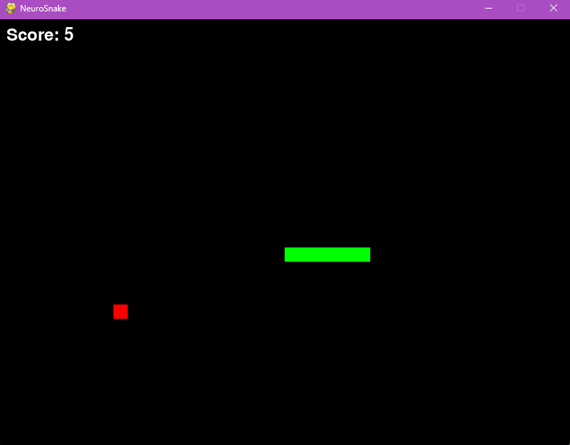
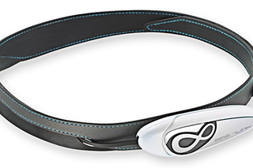
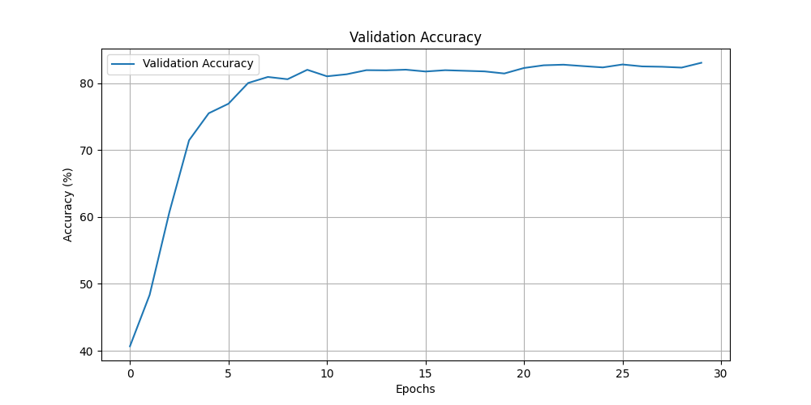

# NeuroSnake

NeuroSnake is a Python-based project that integrates an EEG headset with the classic Snake game. It enables users to generate a dataset by manually playing the game and recording EEG signals, which are later used to train an AI model that controls the game using brain activity.



## Table of Contents
1. [Overview](#overview)
2. [Features](#features)
3. [Components](#components)
4. [Usage](#usage)
5. [Technical Details](#technical-details)
    - [LSTM Classifier](#lstm-classifier)
    - [Brain Controller](#brain-controller)
6. [Hardware Requirements](#hardware-requirements)
7. [Training Results](#training-results)
8. [Credits](#credits)
9. [License](#license)

## Overview
NeuroSnake fuses brain-computer interfacing with classic gaming. By capturing real-time EEG signals through a NeuroSky MindWave Mobile headset, the project enables:
- Manual gameplay to create labeled EEG datasets.
- AI training to learn the mapping between brain signals and game actions.
- Autonomous gameplay where the trained AI controls Snake based on live EEG input.

## Features
- **Real-time EEG Data Collection:** Connects to the MindWave headset to capture brain activity.
- **Snake Game with EEG Control:** Supports both manual play for data recording and AI-driven gameplay.
- **Dataset Recording:** Logs EEG readings alongside corresponding game actions.
- **AI Model Training:** Uses recorded data to train an LSTM-based neural network to predict directional commands.
- **Live Gameplay with AI Control:** Implements real-time EEG signal processing to allow brain-based game control.

## Components
- **`mindwave.py`:** Manages communication with the MindWave headset.
- **`brain_controller.py`:** Integrates real-time EEG processing and AI inference to control the game.
- **`snake_game.py`:** Implements the classic Snake game, offering manual control and data recording functionality.
- **`data_recorder.py`:** Records EEG signals and game actions during manual gameplay.
- **`lstm_classifier.py`:** Trains an LSTM neural network on the recorded EEG-gameplay data to classify directional commands.

## Usage

### 1. Play Snake and Record EEG Data
Start the game in recording mode to play manually while logging EEG data:

```bash
python snake_game.py --record
```

Tip: Press the spacebar to start a 60-second EEG recording session during gameplay.

### 2. Train the AI Model
Process the recorded dataset and train the LSTM classifier:

```bash
python lstm_classifier.py
```

This script normalizes the EEG data, creates fixed-length sequences, and trains the neural network to predict directional commands based on brain signals.

### 3. Play Snake Using EEG Control
Launch the game in EEG control mode to have the AI drive gameplay using real-time brain data:

```bash
python brain_controller.py
```

## Technical Details

### LSTM Classifier
The `lstm_classifier.py` module implements a Long Short-Term Memory (LSTM) network to classify EEG time-series data into four directional commands: UP, DOWN, LEFT, and RIGHT.

#### Data Processing Pipeline
- **Input Data:** CSV files containing three key features:
  - Attention levels (0-100)
  - Meditation levels (0-100)
  - Raw EEG values
- **Preprocessing:** Utilizes RobustScaler to normalize data and reduce the influence of outliers.
- **Sequence Dataset:** The `EEGSequenceDataset` class converts continuous EEG data into fixed-length sequences (default: 200 time steps) using a sliding window, aligning each sequence with a directional label.

#### Model Architecture & Training
- **LSTM Network:**
  - Bidirectional LSTM with 2 stacked layers.
  - Hidden Units: 128 per layer.
  - Dropout: 20% to prevent overfitting.
- **Fully Connected Layers:**
  - Intermediate layer with 64 units and ReLU activation.
  - Final layer with 4 units corresponding to the four directions.
- **Training Configuration:**
  ```python
  SEQUENCE_LENGTH = 200  # Number of time steps per sequence
  HIDDEN_SIZE = 128      # Features in LSTM hidden state
  NUM_LAYERS = 2         # Stacked LSTM layers
  BATCH_SIZE = 256
  LEARNING_RATE = 0.002
  EPOCHS = 30
  TEST_SPLIT = 0.2       # Percentage for testing
  VAL_SPLIT = 0.2        # Percentage of training data for validation
  DROPOUT = 0.2          # Dropout probability
  BIDIRECTIONAL = True   # Use bidirectional LSTM
  INPUT_SIZE = 3         # Number of features (attention, meditation, raw_eeg)
  OUTPUT_SIZE = 4        # Number of classes (UP, DOWN, LEFT, RIGHT)
  ```
- **Training Process:**
  - Optimizer: Adam with a learning rate of 0.002.
  - Loss Function: Cross-entropy.
  - Regularization: Early stopping (patience of 7 epochs) and model checkpointing.
  - Evaluation Metrics: Classification accuracy, loss curves, and confusion matrix.

#### Real-time Classification
The classifier maintains a rolling buffer of EEG data and applies identical preprocessing steps to perform real-time inference, enabling a seamless transition from training to live gameplay.

### Brain Controller
The `brain_controller.py` module bridges the trained LSTM model with the Snake game, creating a real-time brain-computer interface.

#### Core Components
- **RealTimeEEGClassifier:**
  - Continuously captures and processes EEG data.
  - Maintains a sliding window (default: 200 samples) for batch processing.
  - Normalizes incoming data using the same scaler from training.
  - Formats data for LSTM model input.
- **Prediction Engine:**
  - Feeds buffered EEG sequences into the LSTM model.
  - Translates model outputs into directional commands (UP, DOWN, LEFT, RIGHT).
  - Applies a confidence threshold (0.7) to filter out uncertain predictions.
- **Model Management:**
  - Automatically loads the latest trained model and scaler from the designated directory.

#### Hardware Integration & Control Loop
- **EEG Connection:** Establishes a connection to the MindWave headset via a specified COM port.
- **Data Sampling:** Continuously captures:
  - Attention levels
  - Meditation levels
  - Raw EEG values
- **Game Control Loop:**
  - Samples and processes EEG data every frame.
  - Uses Pygame's clock to maintain consistent frame timing.
  - Converts confident predictions into game control signals, updating the game state.
- **Error Handling:**
  - Ensures graceful termination, closing headset connections and cleaning up Pygame resources.
  - Implements exception handling to manage potential connection failures.

## Hardware Requirements
- **EEG Headset:** Compatible with NeuroSky MindWave Mobile (or similar).
  - A cost-effective, single-electrode Mindlink device (~$50) has been successfully used.
  
  

- **Bluetooth:** Either built-in or via an external Bluetooth adapter.

## Training Results
- **Dataset:** Collected from 5 sessions of 60-second EEG recordings at 512Hz, totaling approximately 1,536,000 samples.
- **Model Performance:** Achieved an accuracy of around 83% on the test set, demonstrating robust performance despite the inherent noise and limited electrode data.
    

## Credits
- **MindWave Driver:** The `mindwave.py` module is based on the [python-mindwave](https://github.com/faturita/python-mindwave) project by [faturita](https://github.com/faturita).
- **AI Assistance:** Significant portions of this project were developed with the help of AI tools.

## License
This project is licensed under the [Creative Commons Attribution-NonCommercial 4.0 International License](https://creativecommons.org/licenses/by-nc/4.0/).

